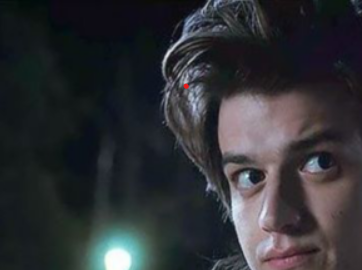
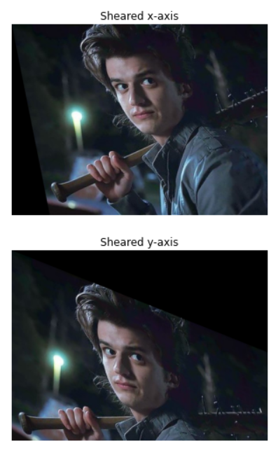
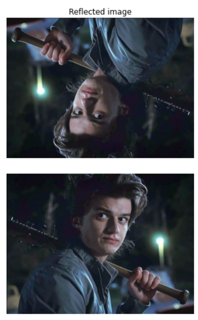
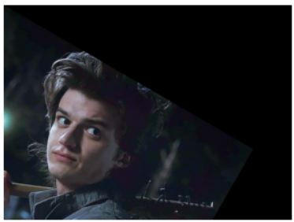
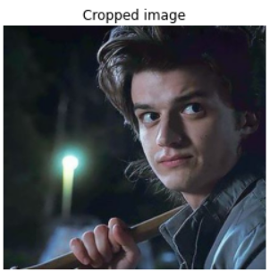

# Image-Transformation
## Aim
To perform image transformation such as Translation, Scaling, Shearing, Reflection, Rotation and Cropping using OpenCV and Python.

## Software Required:
Anaconda - Python 3.7

## Algorithm:
### Step1:
Import the required libraries and read the original image.
### Step2:
Translate the image.
### Step3:
Scale the image.
### Step4:
Shear the image.
### Step5:
Find reflection of image.

### Step 6:
Rotate the image.

### Step 7:
Crop the image.

### Step 8:
Display all the Transformed images.

## Program:
```python
Developed By: Saravana Kumar S
Register Number: 212221230088

import numpy as np
import cv2
import matplotlib.pyplot as plt
img=cv2.imread("steve.jpg")
img=cv2.cvtColor(img,cv2.COLOR_BGR2RGB)
plt.axis('off')
plt.imshow(img)
plt.show()
rows,cols,dim=img.shape

# i)Image Translation
M=np.float32([[1,0,20],
             [0,1,50],
             [0,0,1]])
translated_img=cv2.warpPerspective(img,M,(cols,rows))
plt.axis('off')
plt.imshow(translated_img)
plt.show()
# ii) Image Scaling:
M=np.float32([[1.8,0,0],
             [0,2,0],
             [0,0,1]])
scaled_img=cv2.warpPerspective(img,M,(cols,rows))
plt.axis('off')
plt.imshow(scaled_img)
plt.show()

# iii)Image shearing:
M_x=np.float32([[1,0.2,0],
               [0,1,0],
               [0,0,1]])
M_y=np.float32([[1,0,0],
               [0.4,1,0],
               [0,0,1]])
sheared_img_xaxis=cv2.warpPerspective(img,M_x,(cols,rows))
sheared_img_yaxis=cv2.warpPerspective(img,M_y,(cols,rows))
plt.axis('off')
plt.imshow(sheared_img_xaxis)
plt.title('Sheared x-axis')
plt.show()
plt.axis('off')
plt.imshow(sheared_img_yaxis)
plt.title('Sheared y-axis')
plt.show()

# iv)Image Reflection:
M_x=np.float32([[1,0,0],
               [0,-1,rows],
               [0,0,1]])
M_y=np.float32([[-1,0,cols],
               [0,1,0],
               [0,0,1]])
reflected_img_xaxis=cv2.warpPerspective(img,M_x,(cols,rows))
reflected_img_yaxis=cv2.warpPerspective(img,M_y,(cols,rows))
plt.axis('off')
plt.imshow(reflected_img_xaxis)
plt.title('Reflected image')
plt.show()
plt.axis('off')
plt.imshow(reflected_img_yaxis)
plt.show()

# v)Image Rotation:
angle=np.radians(30)
M=np.float32([[np.cos(angle),-(np.sin(angle)),0],
               [np.sin(angle),np.cos(angle),0],
               [0,0,1]])
rotated_img=cv2.warpPerspective(img,M,(cols,rows))
plt.axis('off')
plt.imshow(rotated_img)
plt.show()

# vi)Image Cropping:
cropped_img=img[10:300,10:330]
plt.axis('off')
plt.imshow(cropped_img)
plt.title('Cropped image')
plt.show()
```
## Output:
### Original image:


### i)Image Translation

<br>

### ii) Image Scaling

<br>

### iii)Image shearing

<br>


### iv)Image Reflection

<br>


### v)Image Rotation

<br>


### vi)Image Cropping

<br>


## Result: 

Thus the different image transformations such as Translation, Scaling, Shearing, Reflection, Rotation and Cropping are done using OpenCV and python programming.
